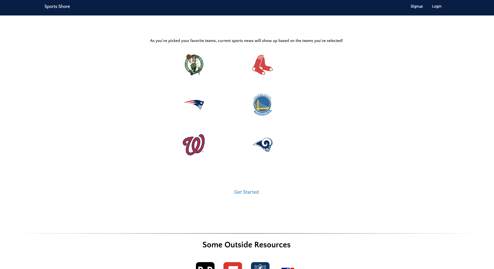
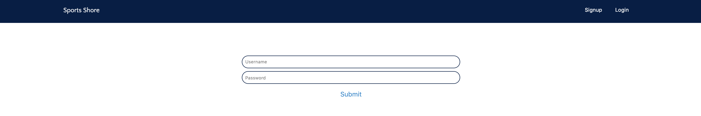
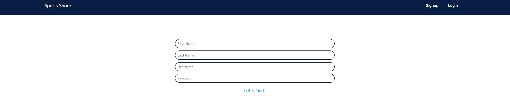
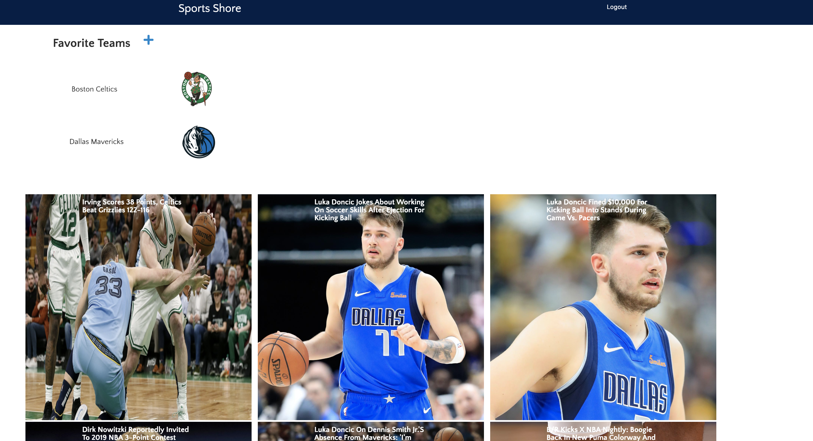

# Sports Shore

### Select your favorite Professional Teams and see current sports news display

When you logged in, you select your favorite team/s then current news articles from the most popular sports media outlets will pop up on the screen.

## Demo

[Live demo (Heroku)](https://hidden-fortress-78993.herokuapp.com/)

## Screenshots

### Landing Page

### Log-In

### SignUp

### Team Dashboard

## Tech Stack Used

- FrontEnd
  - React (Redux Router etc.)
  - Redux
  - HTML5
  - CSS3
  - Javascript
- BackEnd
  - Node.js
  - MongoDB
  - Express.js
  - Mongoose
  - Passport
  - JWT (Authentication)
  - RESTFUL CRUDE Endpoints
- Testing:
  - Mocha
  - Chai
  - Faker
  - Enzyme
- Development/hosting environment
  - mLab
  - Heroku
  - Travis-CI
  - GitHub

## Local Usage

In the project directory, you can run:

npm run dev
Runs the app in the development mode.
Open http://localhost:3000 to view it in the browser.

Note: You will need to have setup and installed the node.js back-end in order to run the application successfully. Back-end link: https://github.com/Bjthomas11/Sports-Shore-Api-Server
